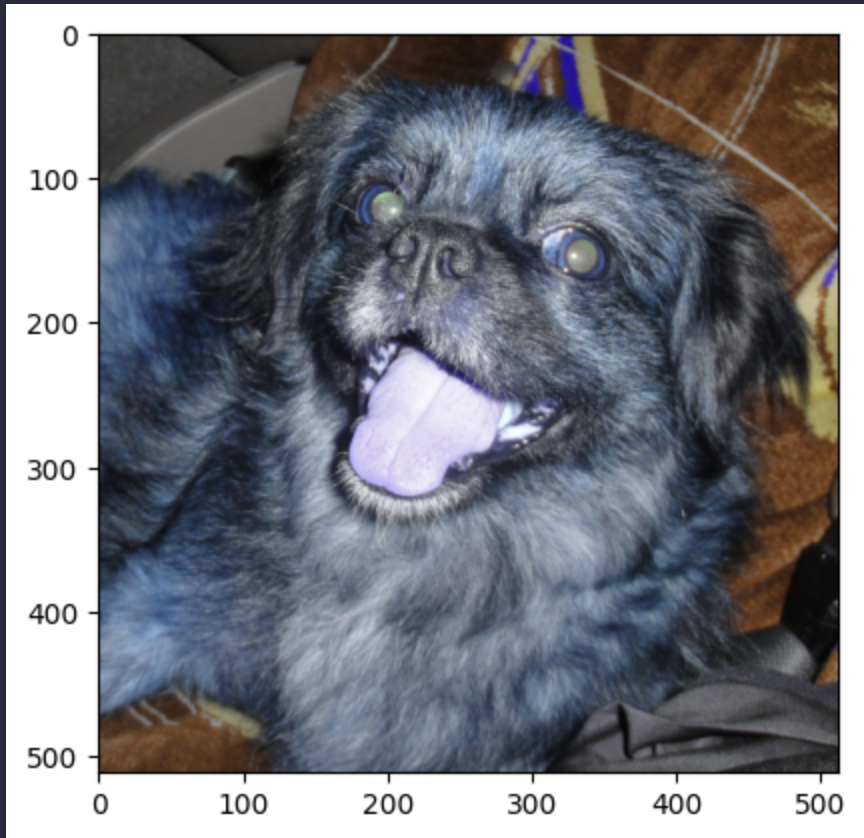
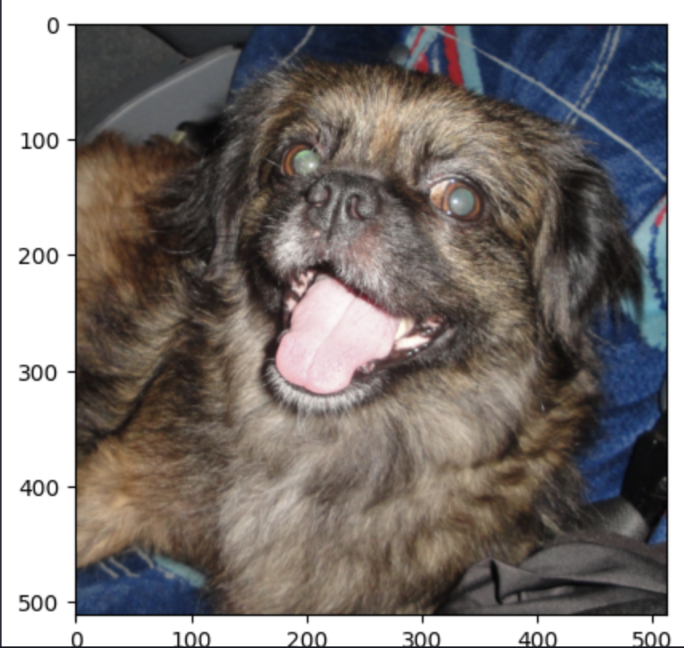

# Manejo de Colores en OpenCV y Matplotlib

## Introducción

Tanto OpenCV como Matplotlib son bibliotecas ampliamente utilizadas para el procesamiento de imágenes y la visualización, respectivamente. Sin embargo, manejan los colores de manera diferente, lo que puede llevar a confusiones si no se tiene cuidado.

## Espacios de Color en OpenCV

OpenCV utiliza el espacio de color BGR (Blue, Green, Red) como predeterminado cuando se leen imágenes. Cada canal de color en una imagen BGR se almacena en una matriz separada, y cuando se combinan, forman la imagen en color completa.

```python
import cv2

# Leer una imagen en formato BGR
image = cv2.imread('imagen.jpg')
```

## Espacios de Color en Matplotlib

A diferencia de OpenCV, Matplotlib utiliza el espacio de color RGB (Red, Green, Blue) para representar y mostrar imágenes. Al igual que en BGR, cada canal de color en una imagen RGB se almacena en una matriz separada.

## ¿Por qué Matplotlib usa RGB?

El espacio de color RGB es el estándar en la mayoría de las aplicaciones de visualización y procesamiento de imágenes. Es más intuitivo y se alinea mejor con la forma en que percibimos los colores en el mundo real. Matplotlib, siendo una biblioteca de visualización, sigue este estándar para mantener la coherencia con otras herramientas y bibliotecas.

## Conversión de Espacios de Color

Para evitar discrepancias al visualizar imágenes, es crucial convertir las imágenes de BGR a RGB cuando se pasan de OpenCV a Matplotlib. OpenCV proporciona la función cvtColor para este propósito.

```py copy showLineNumbers
# Convertir de BGR a RGB
image_rgb = cv2.cvtColor(image, cv2.COLOR_BGR2RGB)
```

## Matplotlib vs OpenCV

A continuación se muestra un ejemplo de cómo se ve una imagen en BGR y RGB.



Ahora una imagen con el manejo correcto de los canales de color

```py copy showLineNumbers
# Manejo de canales de color de una imagen por medio de slicing
plt.imshow(image[:, :, ::-1])
```


