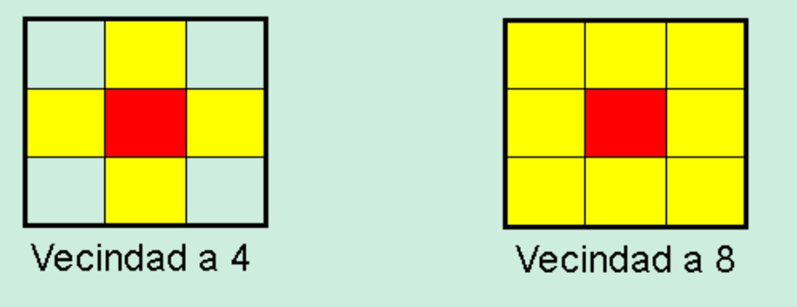

import { Callout } from 'nextra/components'
 
# Vecindades de un pixel

Un pixel p de coordenadas (x,y) tiene 2 vecinos horitontales y verticales cuyas coordernadas están dadas por:

<Callout type="info" emoji="💡">
	(x+1,y),(x-1,y),(x,y+1),(x,y-1)
</Callout>

Este conjunto se llama 4-vecindad de p y se denota como N4p

También existen 4 vecinos diagonales cuyas coordenadas están dadas por:

<Callout type="info" emoji="💡">
	(x+1,y+1),(x+1,y-1),(x-1,y+1),(x-1,y-1)
</Callout>

Dos pixeles son vecinos si cumplen con la definición de adyacencia. Si los pixeles comparten una de sus fronteras, se dice que los mismo son vecinos directos; si solo se tocan e una de sus esquinas indirectos.

Para definir de forma adecuada el concepto de vecindad, es necesario revisar el de adyacencia.
