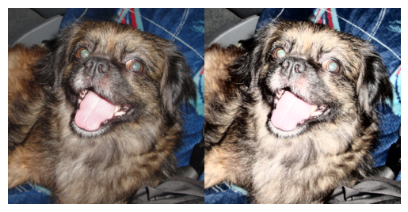

import { Steps } from "nextra/components";

### Procedimiento:
Vamos a poner esto en práctica con un proceso de equalizacion de imagenes.

El proceso en cuestión consta de:
*1.- Convertir la imagen de RGB a YCrCb
*2.- Separar los canales
*3.- Ecualizar el canal Y
*4.- Unir los canales nuevamente en una nueva imagen
*5.- Regresar la imagen a su espacio de color original RGB

<Steps>

### Paso 1: Convertimos la imagen
```py
imageYCrCb = cv.cvtColor(image_color, cv.COLOR_RGB2YCrCb)
```

### Paso 2: Separamos la imagen
```py
y, cr, cb = cv.split(imageYCrCb)
```

### Paso 3: Ecualizamos el canal y
```py
y_ec = cv.equalizeHist(y)
```

### Paso 4: Unimos la imagen nuevamente
```py
newYCrCb_iamge = cv.merge((y_ec, cr, cb))
```

### Paso 5: Regresamos la imagen a su espaccio de color RGB
```py
finalImage = cv.cvtColor(newYCrCb_iamge, cv.COLOR_YCrCb2RGB)
```

### Paso 6: Usamos apilamiento de numpy para poner la imagen inicial y la transformada:
```py
plt.imshow(np.hstack((image_color, imageRGBequY)))
plt.axis("off")
plt.show()
```


* axis("off") = nos permite quitar los ejes coordenados de nuestro plot




</Steps>
