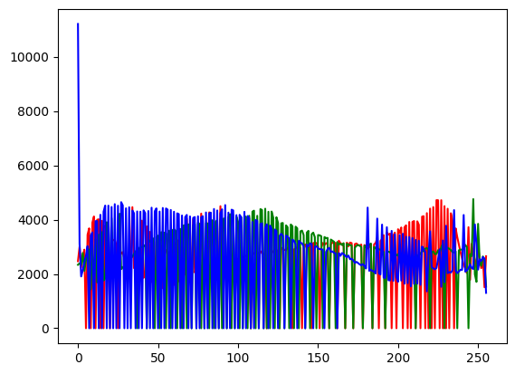

import { Steps } from 'nextra/components'

# Proceso de ecualización

## Definición

La ecualización en el procesamiento digital de imágenes es un proceso que ajusta el contraste de una imagen redistribuyendo sus niveles de intensidad, de manera que los niveles de brillo se distribuyen de manera más uniforme, lo que mejora la visualización y realza los detalles.

## Proceso
<Steps>

### Paso 1: Importamos las bibliotecas necesarias y cargamos la imagen a color

```py
import cv2 as cv
import matplotlib.pyplot as plt
image = cv.imread(r"C:\\chicky_512.png", 0)
```


### Paso 2: Separamos los canales por colores
```py
r, g, b = cv.split(image_color)
```

### Paso 3: Ecualizamos cada canal utilizando la funcion de open CV equalizeHist()
```py
ec_r = cv.equalizeHist(r)
ec_g = cv.equalizeHist(g)
ec_b = cv.equalizeHist(b)
```
### Paso 4: Calculamos el histograma de cada canal ecualizado
```py
histogramR = cv.calcHist([ec_r], [0], None, [256], (0, 256))
histogramG = cv.calcHist([ec_g], [0], None, [256], (0, 256))
histogramB = cv.calcHist([ec_b], [0], None, [256], (0, 256))
```

### Paso 5: ploteamos nuestros histogramas
```py
plt.plot(histogramR, "r")
plt.plot(histogramG, "g")
plt.plot(histogramB, "b")
```


</Steps>
