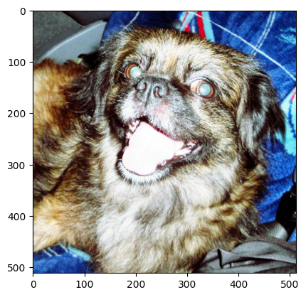

### Cuando ecualizamos una imagen
* Cuando existe mucho verde en nuestra imagen
* No ecualizamos cuando existen muchos negros en nuestra imagen
* No ecualizamos los tres canales, normalmente se suelen ecualizar solo ciertos canales

## ¿Cómo se ve una imagen con los tres canales ecualizados?



Para poder conseguir esta imagen, tenemos que hacer uso de la funcion merge de open CV de la siguiente manera:

```py
newEqimage = cv.merge((ec_r, ec_g, ec_b))
plt.imshow(newEqimage)
```