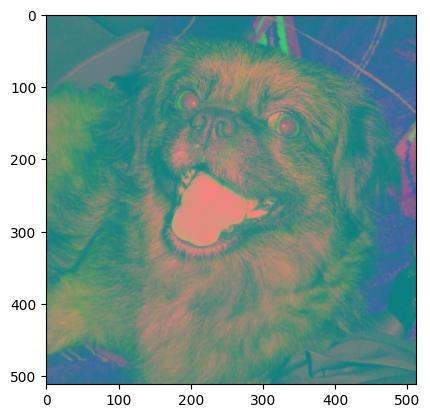

import { Steps } from "nextra/components";

### Cambio de RGB a YCrCb

Vasta co nusar la funcion que nos brinda open CV llamada cvtColor() de la siguiente manera:

```py
imageYCrCb = cv.cvtColor(image, cv.COLOR_RGB2YCrCb)
plt.imshow(imageYCrCb)
```


