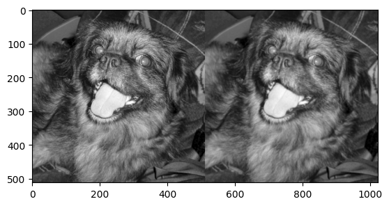

import { Steps } from "nextra/components";

### Procedimiento

<Steps>
### Paso 1: Importamos las bibliotecas necesarias

```py
import numpy as np
import cv2 as cv
```
### Paso 2: Establecemos nuestro Kernel y dividimos los elementos entre 9
```py
np.ones([3, 3], dtype = np.uint8)
```
### Paso 4: cargamos una imagen para que sea nuestra señal de entrada
```py
image = cv.imread(r"C:\\chicky_512.png", 0)
```
### Paso 5: usamos la funcion filter2D() para hacer la convolucion
```py
img_smoothed = cv.filter2D(image, -1, kernel)
```
* image = nuestra imagen
* -1 = aquí tenemos que poner la profundidad de bits de nuestra imagen, en nuestro caso es 8, pero al poner -1 dejamos que open CV seleccione automáticamente la profundidad
* kernel = mandamos nuestro kernel

### Paso 6: mostramos la imagen original y la que fue convolucionada
```py
plt.imshow(np.hstack((iamge, img_smoothed)), "gray")
```

</Steps>