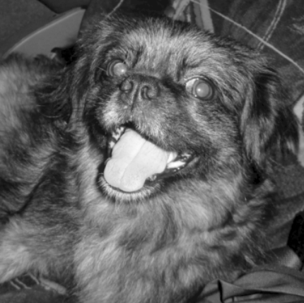
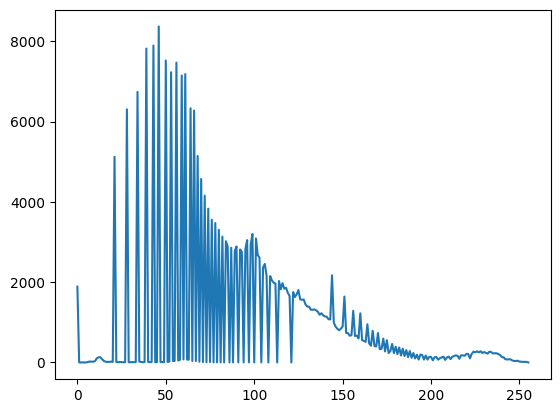

import { Steps } from "nextra/components";

## Pasos para la creación de un histograma de una imagen en escala de grises

<Steps>

### Paso 1: importamos open CV y matplotlib y cargamos la imagen en gris
```py
import cv2 as cv
import matplotlib.pyplot as plt

image = cv.imread(r"C:\\chicky_512.png", 0)
```



### Paso 2: Usar la función calcHist de open CV 
```py
histograma = cv.calcHist([image], [0], None, [256], (0, 255))
```
Esta función recibe como parámetros:

* [image] = la imagen que vamos a utilizar
* [0] = el canal de la imagen a utilizar
* None = este espacio es para poner la máscara, pero en este caso, no vamos a utilizar una
* [256] = el tamaño
* (0, 256) = los rangos de nuestro histograma

### Paso 3: imprimimos el histograma
```py
plt.plot(histograma)
```



</Steps>