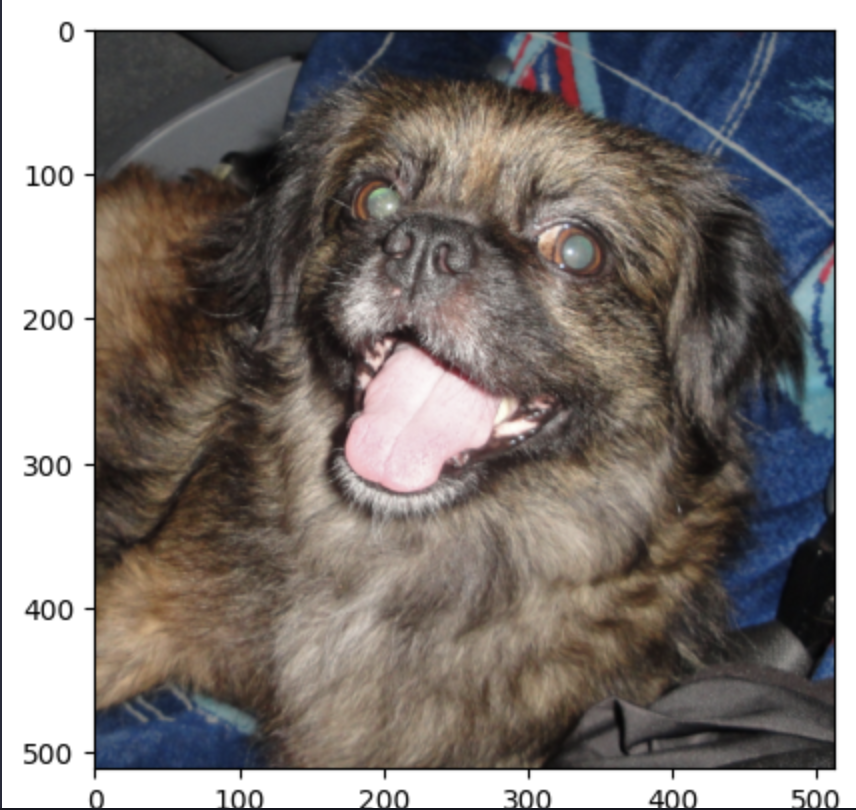

import { Steps } from "nextra/components";

## Pasos para la creación de un histograma de una imagen en RGB

<Steps>

### Paso 1: importamos open CV y matplotlib y cargamos la imagen en RGB
```py
import cv2 as cv
import matplotlib.pyplot as plt

image = cv.imread(r"C:\\chicky_512.png")[, :, ::-1]
```



### Paso 2: Separamos los canales en tres variables diferentes
```py
r, g, b = cv.split(image)
```

### Paso 3: calculamos el histograma uno a uno de cada canal
```py
histogramR = cv.calcHist([r], [0], None, [256], (0, 256))
histogramG = cv.calcHist([g], [0], None, [256], (0, 256))
histogramB = cv.calcHist([b], [0], None, [256], (0, 256))
```

### Paso 4: Utilizamos la función subplot para visualizar los tres histogramas
```py
plt.subplot(131)
plt.title("R")
plt.plot(histogramR, "r")

plt.subplot(132)
plt.title("G")
plt.plot(histogramG, "g")

plt.subplot(133)
plt.title("B")
plt.plot(histogramB, "b")
```


</Steps>

