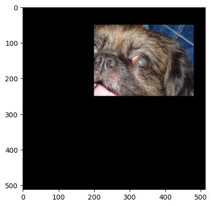

import { Steps } from "nextra/components";

# Procedimiento

<Steps>
### Paso 1: importamos las librerías necesarias y la imagen que vamos a utilizar
```py
import cv2 as cv
import matplotlib.pyplot as plt

image = cv.imread(r"C:\\chicky_512.png", 0)

```

### Paso 2: Creamos una matriz de ceros con las mismas dimensiones de la imagen original
```py
mask = np.zeros_like(image)
```

### Paso 3: Elegimos nuestra region de interes (ROI) y le establecemos valores de 255
```py
ROI = mask[50:250, 200:400] = 255
```

### Paso 4: pasamos la funcion bitwise_and() para unir la máscara con la imagen original y la region de interes
```py
img_mask = np.bitwise_and(iamge, mask)
```

### Paso 5: Mostramos la imagen
```py
plt.imshow(iamge)
```


# Procedimiento facil

Basta con hacer la siguiente operación y obtendremos el mismo resultado

```py
plt.imshow(mask & image)
```


</Steps>