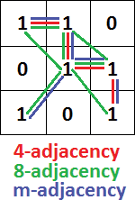

# Adyacencia

## La Adyacencia de un Píxel en Procesamiento de Imágenes

La adyacencia de un píxel en procesamiento de imágenes se refiere a la relación espacial que existe entre un píxel y sus píxeles vecinos en una matriz de píxeles. En una imagen bidimensional, cada píxel tiene una serie de píxeles adyacentes que están directamente conectados a él en función de su posición. Esta información es fundamental en muchas técnicas de procesamiento de imágenes, como la detección de bordes, el filtrado espacial y la segmentación, ya que permite analizar las propiedades locales de una imagen y realizar operaciones específicas basadas en la información de los píxeles circundantes. La adyacencia de un píxel se puede definir de diferentes maneras, como la adyacencia de 4 vecinos (arriba, abajo, izquierda, derecha) o la adyacencia de 8 vecinos (incluyendo también las diagonales), según las necesidades del proceso de análisis o manipulación de la imagen.

